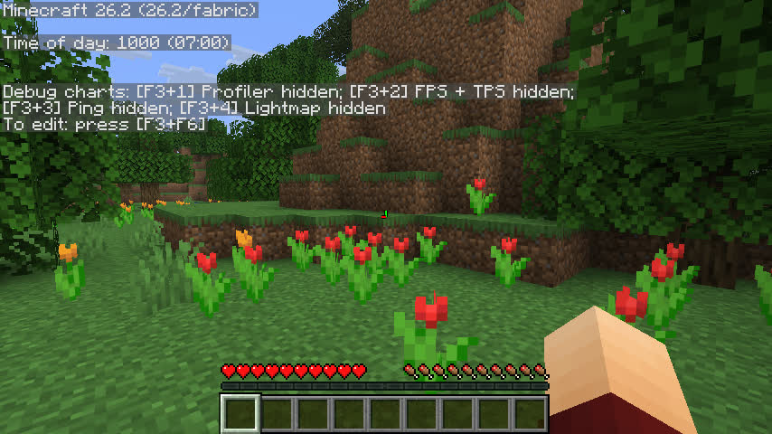
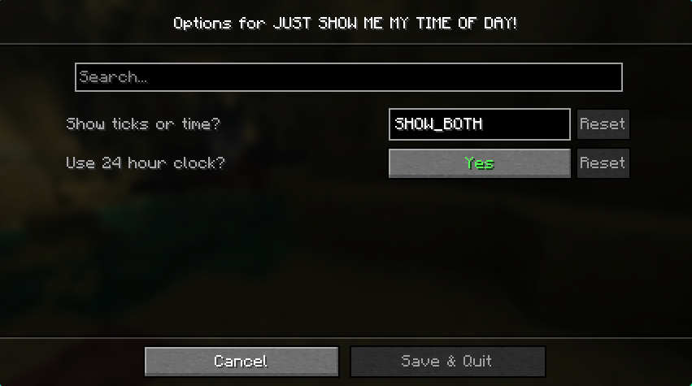

# JUST SHOW ME MY TIME OF DAY!
Shows your time of day in the debug screen. That's it. You can add it as usual to the debug screen (`jsmmtod:time_of_day`), and can also configure it if you add [Cloth Config](https://modrinth.com/mod/cloth-config) and [Mod menu](https://modrinth.com/mod/modmenu).

If you don't have those mods installed, it will default to showing the ticks and time of day in a 24-hour clock (see screenshot below).

## Options
You can go to the config screen through Mod menu.

## Screenshots
Twelve-hour clock:

Only showing ticks:

Only showing time:

In the debug menu:

